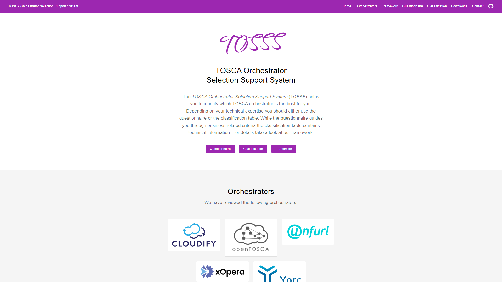
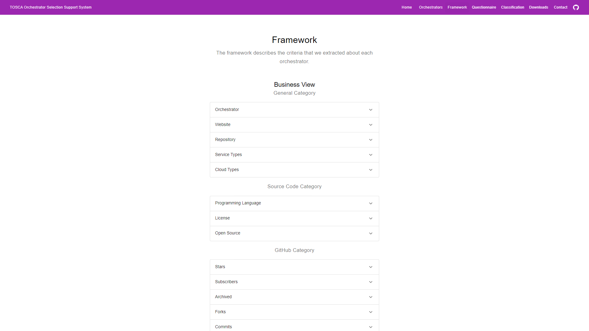
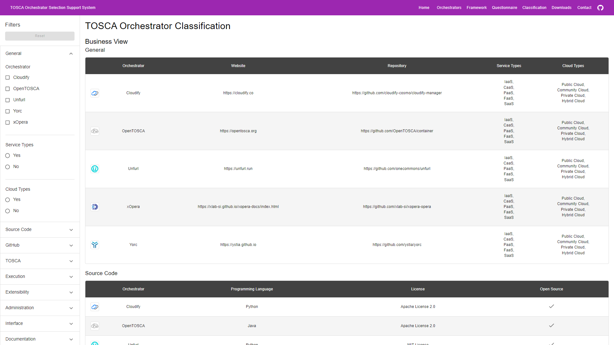
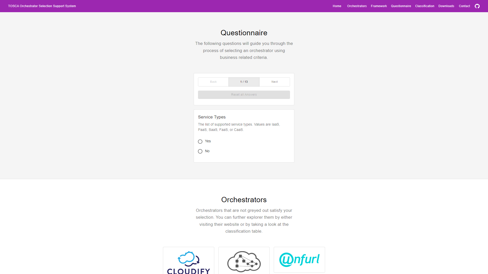

# TOSCA Orchestrator Selection Support System


The TOSCA Orchestrator Selection Support System (TOSSS) helps you to identify which TOSCA orchestrator is the best for
you. Depending on your technical expertise you should either use the questionnaire or the classification table. While
the
questionnaire guides you through business related criteria the classification table contains additional technical
information. For details take a look at our framework.

## How to Start a Development Server

```shell
yarn install    # install dependencies
yarn start      # start development server

# visit localhost:3000
```

## How to Deploy a Release

A workflow is started on pushed to the `main` branch, that deploys on GitHub Pages.

## How to Adjust the Framework

- adjust respective criteria in [public/config/framework.yaml](public/config/framework.yaml)
- the framework is validated against the respective JSON Schema (see below)

## How to Adjust an Orchestrator

- adjust respective data in [public/config/classification.yaml](public/config/classification.yaml)
- the data is validated against the framework

## How to Add a New Orchestrator

- add respective data to [public/config/classification.yaml](public/config/classification.yaml)
- the data is validated against the framework
- add icon to [public/config/img](public/config/img) following the naming schema `<orchestrator-id>-icon.png`
- add logo to [public/config/img](public/config/img) following the naming schema `<orchestrator-id>-logo.png`

## Screenshots

## Landing Page



### Framework



### Classification



### Questionnaire



## JSON Schema for the Framework

```json
{
  "type": "array",
  "items": {
    "type": "object",
    "properties": {
      "id": {
        "type": "string"
      },
      "name": {
        "type": "string"
      },
      "categories": {
        "type": "array",
        "items": {
          "type": "object",
          "properties": {
            "id": {
              "type": "string"
            },
            "name": {
              "type": "string"
            },
            "criteria": {
              "type": "array",
              "items": {
                "type": "object",
                "properties": {
                  "id": {
                    "type": "string"
                  },
                  "name": {
                    "type": "string"
                  },
                  "description": {
                    "type": "string"
                  },
                  "type": {
                    "enum": [
                      "string",
                      "number",
                      "boolean",
                      "date",
                      "strings"
                    ]
                  },
                  "values": {
                    "type": "array",
                    "items": {
                      "type": "string"
                    }
                  },
                  "hidden_inside_filter": {
                    "type": "boolean"
                  },
                  "hidden_inside_table": {
                    "type": "boolean"
                  },
                  "hidden_inside_questionnaire": {
                    "type": "boolean"
                  },
                  "hidden_inside_framework": {
                    "type": "boolean"
                  }
                },
                "required": [
                  "id",
                  "name",
                  "description",
                  "type"
                ],
                "additionalProperties": false
              }
            }
          },
          "required": [
            "id",
            "name",
            "criteria"
          ],
          "additionalProperties": false
        }
      }
    },
    "required": [
      "id",
      "name",
      "categories"
    ],
    "additionalProperties": false
  }
}
```

## Haftungsausschluss

Dies ist ein Forschungsprototyp. Die Haftung für entgangenen Gewinn, Produktionsausfall, Betriebsunterbrechung,
entgangene Nutzungen, Verlust von Daten und Informationen, Finanzierungsaufwendungen sowie sonstige Vermögens- und
Folgeschäden ist, außer in Fällen von grober Fahrlässigkeit, Vorsatz und Personenschäden ausgeschlossen.

## Disclaimer of Warranty

Unless required by applicable law or agreed to in writing, Licensor provides the Work (and each Contributor provides its
Contributions) on an "AS IS" BASIS, WITHOUT WARRANTIES OR CONDITIONS OF ANY KIND, either express or implied, including,
without limitation, any warranties or conditions of TITLE, NON-INFRINGEMENT, MERCHANTABILITY, or FITNESS FOR A
PARTICULAR PURPOSE. You are solely responsible for determining the appropriateness of using or redistributing the Work
and assume any risks associated with Your exercise of permissions under this License.


## Acknowledgements

This project is developed for the purpose of research by the [Institute of Software Engineering (ISTE)](https://www.iste.uni-stuttgart.de) and the [Institute of Architecture of Application Systems (IAAS)](https://www.iaas.uni-stuttgart.de) of the [University of Stuttgart, Germany](https://www.uni-stuttgart.de).
The development is partially funded by the [German Federal Ministry for Economic Affairs and Climate Action (BMWK)](https://www.bmwk.de/Navigation/EN/Home/home.html) as part of the [Software-Defined Car (SofDCar)](https://sofdcar.de) project (19S21002).
